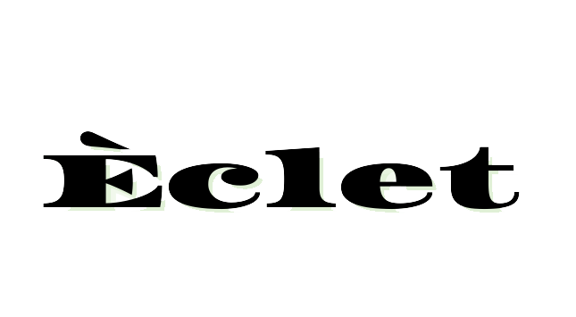

  

Projeto desenvolvido para a **BartoTêc 2023** (feira tecnológica da Etec Bartolomeu). Trata-se de um blog de moda com funcionalidades completas de interação, focado na integração entre front-end e back-end.

---

 # Funcionalidades

-  **Sistema de Autenticação:** Cadastro e login de usuários.
-  **Perfil do Usuário:** Gerenciamento de informações pessoais.
-  **Conteúdo Dinâmico:** Acesso a artigos e tendências de moda.
-  **Consultoria Online:** Simulação de venda de pacotes de planos para consultoria de moda.

# Tecnologias Utilizadas

O projeto foi construído utilizando as seguintes tecnologias:

* **Front-end:** HTML5, CSS3 e JavaScript.
* **Back-end:** PHP.
* **Banco de Dados:** SQL (MySQL).
* **Ambiente de Desenvolvimento:** Laragon.

## Screenshots

### Interface Principal

  <kbd>
    
  </kbd>
   <em>Tela Home</em>

---

### Navegação e Conteúdo

  
Clique para ver as telas de conteúdo (Estilos, Tecidos, etc.)

  #### Estilos
  
  #### Tecidos
  
  #### Sustentabilidade
  
  #### Informações
  

### Área do Usuário e Planos

  
Clique para ver Telas de Login, Cadastro e Planos

  #### Planos de Consultoria
  
  #### Login
  
  #### Cadastro
  
  #### Recuperar Senha
  
  #### Perfil do Usuário
  

